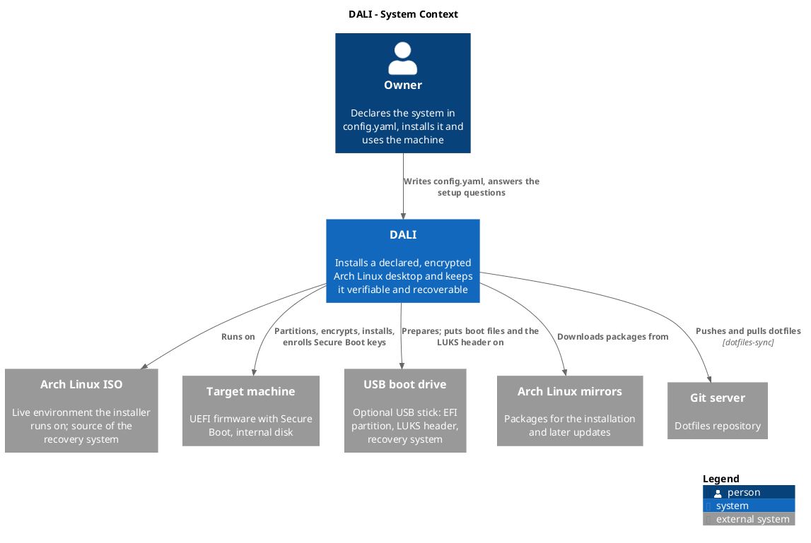
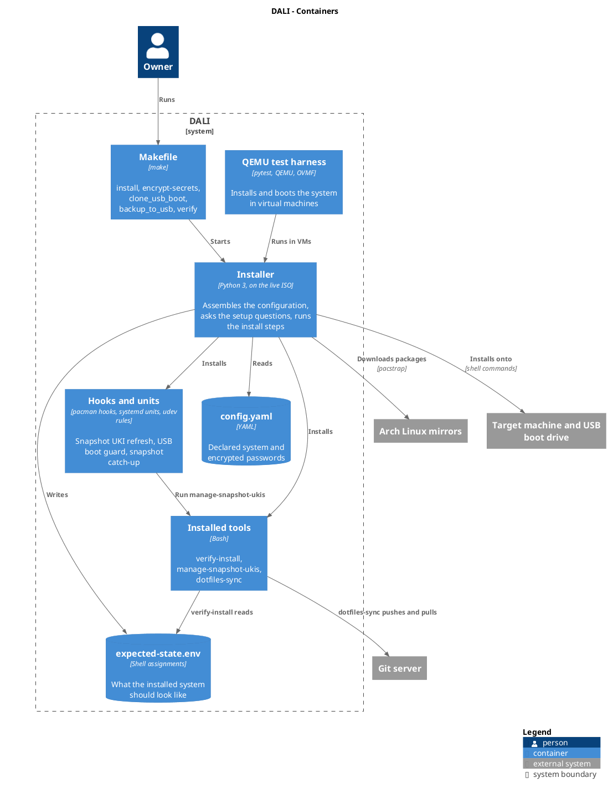
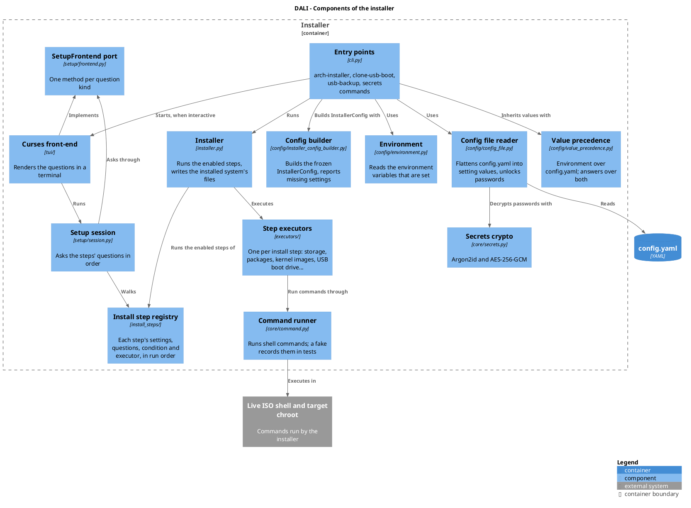
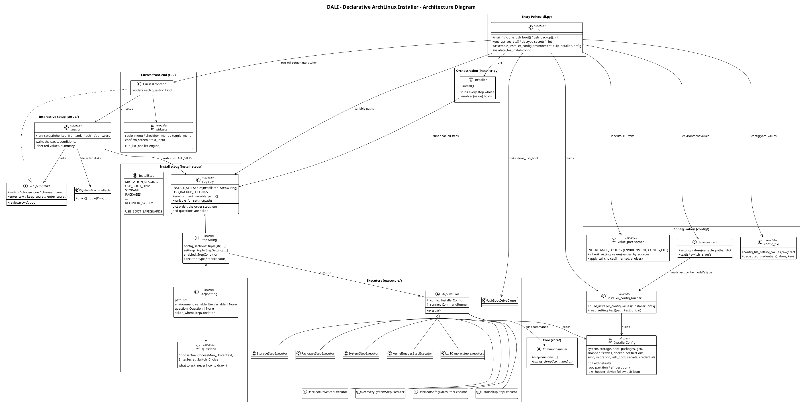
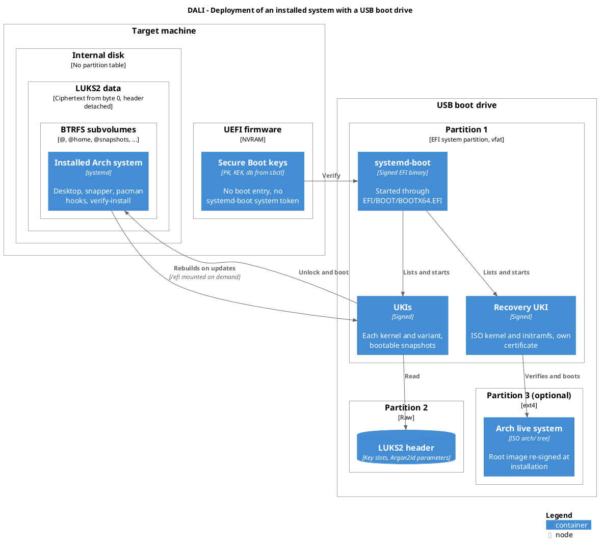
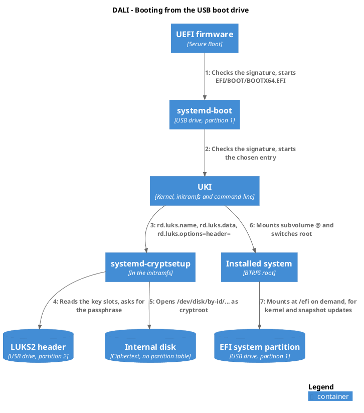

# Architecture

The architecture is described with the [C4 model](https://c4model.com): four levels of zoom, from the system in its surroundings down to the code, plus a deployment view and a dynamic view. The deployment view matters more here than in most projects, because much of what DALI does is decide what ends up where: on the internal disk, on the USB boot drive, in the firmware.

The diagrams are PlantUML files in `docs/diagrams/`, using the C4-PlantUML library that ships with PlantUML. `make diagrams` renders them to PNG.

## Level 1: System Context

The owner declares the system in `config.yaml` and runs DALI from the Arch Linux ISO. DALI installs onto the target machine, enrolls its own Secure Boot keys in the firmware and, when configured, prepares a USB boot drive. Packages come from the Arch Linux mirrors. After the installation, `dotfiles-sync` keeps configuration files in a git repository.

## Level 2: Containers

| Container | Runs | Role |
| --- | --- | --- |
| Makefile | on the live ISO or the installed system | Entry point for installing, encrypting secrets, cloning the USB boot drive, backups and verification |
| Installer | Python 3 on the live ISO | Assembles the configuration, asks the setup questions, runs the install steps |
| config.yaml | file | The declared system, with encrypted passwords |
| Installed tools | Bash on the installed system | `verify-install`, `manage-snapshot-ukis`, `dotfiles-sync` |
| Hooks and units | pacman, systemd and udev on the installed system | Refresh snapshot UKIs, guard boot files while the USB boot drive is away, build snapshot UKIs when it comes back |
| expected-state.env | file on the installed system | What `verify-install` checks the system against |
| QEMU test harness | pytest, QEMU and OVMF on a developer machine | Installs and boots the system in virtual machines |

## Level 3: Components of the Installer

The installer works in two phases.

1. **Configuration.** The entry points read the environment variables that are set and the values in `config.yaml` (whose passwords the secrets crypto decrypts). Value precedence decides which source wins. When interactive, the curses front-end runs the setup session, which walks the install step registry and asks each question through the `SetupFrontend` port. The config builder then turns the values into one frozen `InstallerConfig`, or reports every missing setting at once.
2. **Installation.** The installer runs the executor of each step whose condition holds, in registry order. Executors run every command through the command runner, which the unit tests replace with a fake that records the commands.

The install step registry is the center: each step declares its settings (config key, environment variable, question), the condition under which it runs and its executor. The setup session, the environment reader and the installer all read it, so a step is wired in one place. A different front-end, such as a graphical one, would implement `SetupFrontend` and change nothing else.

## Level 4: Code

`docs/diagrams/architecture.puml` is a class diagram of the main types: the registry and its wiring types, the configuration model and its builder, the setup session and its front-end port, and the step executors.

The flow of an installation from start to finish is in [`installer-flow.puml`](diagrams/installer-flow.png).

## Deployment

An installed system with a USB boot drive. The internal disk holds LUKS2 ciphertext from its first byte, without a partition table or header. The USB stick holds the EFI system partition (systemd-boot, the UKIs, the recovery UKI), the LUKS2 header and, optionally, the Arch live system for recovery. The firmware holds the Secure Boot keys and no boot entry. Without a USB boot drive, the EFI partition and the LUKS header are on the internal disk instead. See [USB Boot Drive](usb-boot.md).

## Dynamic: Booting from the USB Boot Drive

The firmware starts systemd-boot from the stick, which starts the chosen UKI. The UKI's command line names the LUKS header on the stick and the internal disk by its `/dev/disk/by-id` name. systemd-cryptsetup reads the header, asks for the passphrase and opens the disk. Once the system runs, it mounts the stick's EFI partition at `/efi` on demand, so kernel and snapshot updates land on the stick.
