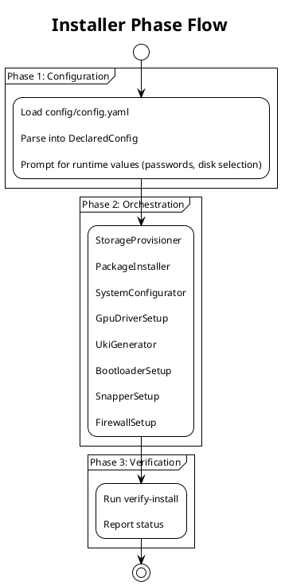

# Development

## Project Structure

```
arch_installer/
├── config/
│   └── config.yaml              # main configuration, main source of truth
├── src/arch_installer/
│   ├── installer.py             # orchestrator
│   ├── config/                  # YAML loading, dataclasses
│   ├── core/                    # command runner, runtime state
│   ├── steps/                   # installation steps
│   └── templates/               # config file templates
├── scripts/                     # old implementation in bash
├── tests/
│   ├── unit/                    # fast, isolated tests
│   ├── integration/             # integration tests, modules are combined
│   └── qemu/                    # full VM tests
└── docs/
```

## Running the Installer

### Using Make (Recommended)

The Makefile provides the canonical entry point:

```bash
make install          # Full installation: deps + run
make gui-install      # GUI installer with visual interface
make deps             # Install dependencies only
make run              # Run installer (assumes deps installed)
```

### With Environment Variables

```bash
LUKS_PASSWORD=lukspass USER_PASSWORD=userpass NON_INTERACTIVE=true make install
```

#### Complete Environment Variable Reference

| Variable               | Description                                       | Required                                               |
| ---------------------- | ------------------------------------------------- | ------------------------------------------------------ |
| `LUKS_PASSWORD`        | LUKS encryption password                          | Yes (unless encrypted in `secrets` in config.yaml)     |
| `USER_PASSWORD`        | User account password                             | Yes (unless encrypted in `secrets` in config.yaml)     |
| `TARGET_DISK`          | Target disk for installation (e.g., /dev/nvme0n1) | Yes (unless filled in `storage.target_disk` or prompt) |
| `NON_INTERACTIVE`      | Set to `true` for fully automated installation    | No                                                     |
| `CONFIG_PATH`          | Path to custom config.yaml                        | No                                                     |
| `VERBOSE`              | Set to `true` for verbose output                  | No                                                     |
| `ENABLE_SNAPSHOT_BOOT` | Set to `true` to enable bootable snapshots        | No                                                     |
| `ENABLE_UFW`           | Set to `true` to enable UFW firewall              | No (default: true)                                     |
| `ENABLE_HIBERNATION`   | Set to `true` to enable hibernation               | No                                                     |
| `ENABLE_DOCKER`        | Set to `true` to enable Docker installation       | No (or prompt)                                         |
| `ENABLE_MIGRATION`     | Set to `true` for migration from existing system  | No                                                     |
| `SKIP_SWAP`            | Set to `true` to skip swapfile creation           | No                                                     |
| `PACKAGE_PROFILE`      | Package profile to use (base, desktop, full)      | No (default: base)                                     |
| `GPU_VENDOR`           | GPU vendor (amd, intel, nvidia, none)             | No (or prompt)                                         |
| `CPU_VENDOR`           | CPU vendor (intel, amd)                           | Yes (or prompt)                                        |
| `DESKTOP_ENVIRONMENT`  | Desktop to install (gnome, kde, hyprland, none)   | No (or prompt)                                         |
| `SELECTED_KERNELS`     | Comma-separated kernel names to install           | No                                                     |
| `WIPE_METHOD`          | Disk wipe method (quick, secure, discard, skip)   | No (default: quick, or prompt)                         |
| `SOURCE_LUKS_PASSWORD` | Password for existing LUKS volume (migration)     | Migration only                                         |
| `SECRETS_KEY`          | Key to decrypt encrypted passwords in config      | Only if using encrypted `secrets` in config.yaml       |
| `TEST_SWAP_SIZE_MB`    | Override swap size for testing                    | Testing only                                           |
| `TEST_EFI_SIZE_MB`     | Override EFI partition size for testing           | Testing only                                           |

### Direct Python Execution

For development:

```bash
poetry install
poetry run arch-installer
```

Or without poetry (requires Python 3.13+):

```bash
pip install -e .
python -m arch_installer.installer
```

## Code Flow

### Three Phases



#### Phase 1: Configuration Loading

Everything starts with `config/config.yaml`. The loader parses this into typed Python structs. The config is immutable once loaded.

#### Phase 2: Orchestration

`installer.py` runs steps in a fixed order. Each step gets only the config sections it needs. Steps can be excluded via options (e.g., `--skip-swap`, `SKIP_SWAP=true`), or through interactive prompts when not in non-interactive mode.

#### Phase 3: Command Execution

Each step uses a `CommandRunner` to execute shell commands. This abstraction exists for testability:

- `SystemCommandRunner`: runs real subprocess calls
- `FakeCommandRunner`: records commands for unit tests

### RuntimeConfig vs DeclaredConfig

Two config types serve different purposes:

| Type             | Source                  | Mutable     | Purpose                                      |
| ---------------- | ----------------------- | ----------- | -------------------------------------------- |
| `DeclaredConfig` | YAML file               | No (frozen) | What you want installed                      |
| `RuntimeConfig`  | User prompts, detection | Yes         | Runtime state (passwords, detected hardware) |

The installer combines both: declared intent from the config file, runtime values from user input or hardware detection.

## File Layout

```
src/arch_installer/
├── installer.py                # orchestrator
├── errors.py                   # custom exceptions
├── config/
│   ├── loader.py               # YAML parsing
│   └── models.py               # dataclasses (frozen)
├── core/
│   ├── command.py              # CommandRunner interface
│   ├── context.py              # InstallContext for step execution
│   ├── runtime_state.py        # RuntimeConfig (mutable state)
│   ├── interaction.py          # InteractionStrategy interface, HardwareDetector
│   ├── cli_interaction.py      # CLI implementation of InteractionStrategy
│   ├── prompts.py              # backward-compatible wrapper for CLI interaction
│   ├── secrets.py              # encrypted password handling
│   └── distro.py               # distribution detection
├── gui/
│   ├── __init__.py             # GUI installer entry point
│   ├── __main__.py             # module runner
│   └── gui_interaction.py      # GUI implementation of InteractionStrategy
├── steps/
│   ├── storage.py              # disk, LUKS, BTRFS, swap, wipe methods
│   ├── packages.py             # pacstrap, fstab
│   ├── system.py               # hostname, locale, user
│   ├── gpu.py                  # driver setup
│   ├── boot.py                 # UKI, systemd-boot, secure boot
│   ├── snapper.py              # snapshots
│   ├── bootable_snapshots.py   # bootable snapshot hooks
│   ├── migration.py            # migration from existing install
│   └── firewall.py             # UFW setup
└── templates/
    ├── boot.py                 # UKI/boot templates
    ├── gpu.py                  # GPU config templates
    ├── snapper.py              # snapper config templates
    └── systemd.py              # systemd service templates

docs/
├── diagrams/
│   └── architecture.puml       # PlantUML class diagram
├── code-analysis.md            # redundancy/overlap analysis
├── development.md              # this file
└── ...                         # other documentation
```

## Architecture Documentation

### UML Class Diagram

A PlantUML class diagram is available at `docs/diagrams/architecture.puml`. It shows:

- All classes, dataclasses, and enums
- Relationships (inheritance, composition, dependencies)
- Key methods and attributes
- Design patterns used (Strategy, Command)

To generate the diagram:

```bash
# requires plantuml installed
plantuml docs/diagrams/architecture.puml
```

### Code Analysis

A comprehensive analysis of the codebase is available at `docs/code-analysis.md`. It includes:

- Description table for all classes and their responsibilities
- Identified redundancies and potential improvements
- Recommendations for code reduction

## Adding a New Step

1. Create `steps/new_step.py` with a class that takes config + runner
2. Add it to the step list in `installer.py`
3. Add any new config sections to `models.py`
4. Write tests in `tests/unit/test_new_step.py`
5. Add assertions in main Qemu tests in `tests/qemu/test_installation.py` (if applicable)

## Idempotent Design

The installer can be run multiple times safely.

This means you can:

- Re-run after a failed installation
- Add packages by modifying config and re-running
- Use the installer as a "converger" to enforce system state

## Testing

### Unit Tests

Fast isolated tests that mock the command runner:

```bash
make test # or: poetry run pytest tests/unit/ -v
```

### QEMU Integration Tests

Full VM-based installation tests:

```bash
# automated tests
make test-qemu ISO=/path/to/archlinux.iso
make test-qemu-full ISO=/path/to/archlinux.iso  # full installation test
```

### Manual QEMU Testing

For interactive testing and debugging, use the manual QEMU test script:

```bash
./tests/qemu/qemu_manual_test.sh [ISO_PATH] [OPTIONS]
```

This script launches a QEMU VM with:

- UEFI secure boot in setup mode (keys can be enrolled after install)
- VNC display for visual interaction
- SSH access for command execution

**Options:**

| Option        | Description                        | Default               |
| ------------- | ---------------------------------- | --------------------- |
| `--disk-size` | Disk size in GB                    | 40                    |
| `--memory`    | RAM size in MB                     | 4096                  |
| `--work-dir`  | Working directory for VM files     | /tmp/qemu-manual-test |
| `--vnc-port`  | VNC display port offset            | 50 (VNC port 5950)    |
| `--ssh-port`  | SSH port forwarding                | 2222                  |
| `--keep`      | Keep VM files after exit           |                       |
| `--headless`  | Run without VNC display (SSH only) |                       |

**Example:**

```bash
# start VM with default settings
./tests/qemu/qemu_manual_test.sh /path/to/archlinux.iso

# with custom options
./tests/qemu/qemu_manual_test.sh /path/to/archlinux.iso --disk-size 60 --memory 8192 --keep
```

**Access methods:**

```bash
# SSH access (password: root, set by script after boot)
ssh -o StrictHostKeyChecking=no -o UserKnownHostsFile=/dev/null root@localhost -p 2222

# VNC access
# Connect to localhost:5950 (or your configured vnc-port + 5900)
```

**Post-installation steps:**

1. Reboot the VM into the installed system
2. The system will be in secure boot setup mode
3. Enroll your keys with: `sbctl enroll-keys --microsoft`
4. Reboot again - secure boot is now active

## Contributing

Thank you for taking time out of your day to look at this project, PRs are welcomed.
