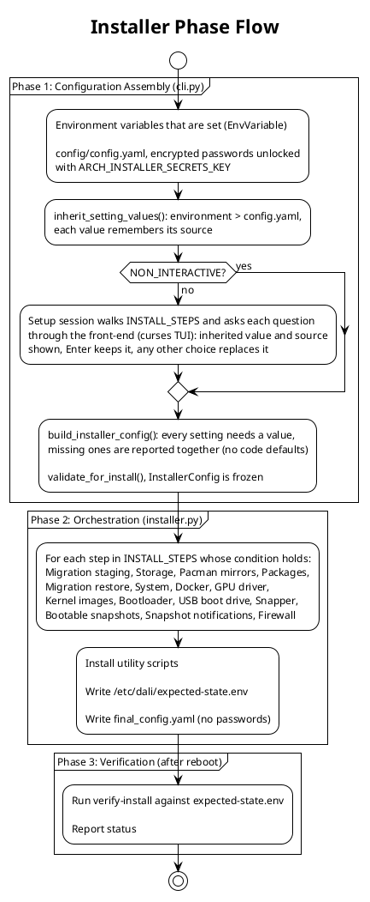

# Development

## Project Structure

```
arch_installer/
├── config/
│   └── config.yaml              # main configuration, main source of truth
├── src/arch_installer/
│   ├── cli.py                   # entry points and config resolution
│   ├── installer.py             # orchestrator and section pipeline
│   ├── config/                  # config model, YAML loader, environment variables
│   ├── core/                    # command runner, logging, secrets crypto
│   ├── executors/               # one executor per config section
│   └── tui/                     # curses interactive setup
├── scripts/                     # utilities installed on the target system
├── tests/
│   ├── unit/                    # fast, isolated tests
│   └── qemu/                    # full VM tests
└── docs/
```

## Running the Installer

### Using Make (Recommended)

The Makefile provides the canonical entry point:

```bash
make install          # Full installation: deps + run
make deps             # Install dependencies only
make run              # Run installer (assumes deps installed)
make lint             # ruff check + format check
make format           # ruff format + safe fixes
```

### With Environment Variables

```bash
LUKS_PASSWORD=lukspass USER_PASSWORD=userpass NON_INTERACTIVE=true make install
```

Every variable is listed in the [Configuration reference](configuration.md#environment-variables).
Their names live in one place in the code: the `EnvVar` enum in `config/environment.py`.

### Direct Python Execution

For development:

```bash
poetry install
poetry run arch-installer
```

Or without poetry (requires Python 3.13+):

```bash
pip install -e .
python -m arch_installer.cli
```

## Code Flow

### Three Phases



#### Phase 1: Configuration Resolution

`cli.py` builds one `InstallerConfig` in a fixed order, each step overriding the previous one:

1. defaults: every field default in `config/models.py`
2. `config/config.yaml`, with its encrypted passwords unlocked by `ARCH_INSTALLER_SECRETS_KEY`
3. environment variables (`Environment.override` in `config/environment.py`)
4. the TUI, unless `NON_INTERACTIVE=true`: every screen starts on the value inherited from steps 1-3, Enter keeps it and any other choice overrides it

The result is validated (`validate_for_install`) and is immutable from then on.

#### Phase 2: Orchestration

`installer.py` holds a `PIPELINE` of sections. Each `Section` has a label, an `enabled(config)` predicate and an executor class. The `Installer` runs the enabled sections in order; every executor receives the same finished `InstallerConfig`, so a choice is decided in exactly one place: the config.

#### Phase 3: Command Execution

Each executor uses a `CommandRunner` to execute shell commands. This abstraction exists for testability:

- `SystemCommandRunner`: runs real subprocess calls
- `FakeCommandRunner`: records commands for unit tests

### One Config Model

There is a single frozen dataclass tree, `InstallerConfig`. Answers from the environment or the TUI produce a new instance via `dataclasses.replace`, never a parallel "runtime" object, so every executor and the generated `final_config.yaml` see the values that were actually installed. Passwords live in `InstallerConfig.credentials` and are left out of `final_config.yaml` by `exportable_config()`.

## File Layout

```
src/arch_installer/
├── cli.py                      # entry points: install, usb-init, usb-backup, secrets helpers
├── installer.py                # Installer orchestrator and the PIPELINE of sections
├── errors.py                   # custom exceptions
├── config/
│   ├── models.py               # InstallerConfig and its sections (frozen), enums, defaults
│   ├── loader.py               # YAML -> InstallerConfig, driven by the model's type hints
│   ├── environment.py          # EnvVar names, typed readers, override(), unlock_secrets()
│   └── secrets_file.py         # writes encrypted passwords into config.yaml, keeping comments
├── core/
│   ├── command.py              # CommandRunner interface, SystemCommandRunner
│   ├── log.py                  # stdlib logging setup (stdout progress, stderr problems)
│   └── secrets.py              # AES-256-GCM encryption of stored passwords
├── executors/
│   ├── base.py                 # Executor base class, file/mount helpers
│   ├── storage.py              # disk wipe, partitions, LUKS, BTRFS, swap
│   ├── mirrors.py              # pacman mirrorlist
│   ├── packages.py             # pacstrap, fstab, display manager
│   ├── system.py               # hostname, locale, user
│   ├── docker.py               # Docker daemon and access group
│   ├── gpu.py                  # proprietary NVIDIA driver setup
│   ├── boot.py                 # mkinitcpio, UKI variants, secure boot, systemd-boot
│   ├── snapper.py              # snapshots, bootable snapshots, notifications
│   ├── migration.py            # migration from an existing install
│   ├── firewall.py             # UFW setup (configured offline, enabled on boot)
│   ├── usb_boot.py             # USB boot drive
│   └── usb_backup.py           # USB backup partition
└── tui/
    ├── app.py                  # screen flow: InstallerConfig in, InstallerConfig out
    └── widgets.py              # curses widgets (radio, checkbox, toggles, text entry)

scripts/                        # installed to /usr/local/bin on the target
├── manage_snapshot_entries.sh  # manage-snapshot-ukis
├── verify_install.sh           # verify-install (also `make verify`)
└── dotfiles-sync.sh            # dotfiles-sync

docs/
├── diagrams/
│   └── architecture.puml       # PlantUML class diagram
├── functional-map.md           # every entry point, module and test, mapped
├── development.md              # this file
└── ...                         # other documentation
```

## Architecture Documentation

### UML Class Diagram

A PlantUML class diagram is available at `docs/diagrams/architecture.puml`. It shows:

- The entry points, the config model and how it is resolved
- The orchestrator, its `PIPELINE` of sections and the executors
- The `CommandRunner` port that executors run every command through

To generate the diagram:

```bash
# requires plantuml installed
make diagrams
```

### Functional Map

`docs/functional-map.md` maps every entry point, module, config section and test to what it does. `docs/code-analysis.md` is a historical analysis of the code before the restructure and no longer matches it.

## Adding a New Section

1. Add the config section to `config/models.py` (a frozen dataclass with defaults) and a field for it on `InstallerConfig`
2. Create `executors/new_section.py` with an `Executor` subclass implementing `execute()`
3. Add a `Section(label, enabled, executor)` to `PIPELINE` in `installer.py`, in the right order
4. If it needs an environment override, add the name to `EnvVar` and the override to `Environment.override`
5. Write tests in `tests/unit/test_new_section.py`
6. Add assertions in the main QEMU tests in `tests/qemu/test_installation.py` (if applicable)

## Idempotent Design

The installer can be run multiple times safely.

This means you can:

- Re-run after a failed installation
- Add packages by modifying config and re-running
- Use the installer as a "converger" to enforce system state

## Testing

### Unit Tests

Fast isolated tests that mock the command runner:

```bash
make test # or: poetry run pytest tests/unit/ -v
```

### QEMU Integration Tests

Full VM-based installation tests:

```bash
# automated tests
make test-qemu ISO=/path/to/archlinux.iso
make test-qemu-full ISO=/path/to/archlinux.iso  # full installation test
```

### Manual QEMU Testing

For interactive testing and debugging, use the manual QEMU test script:

```bash
./tests/qemu/qemu_manual_test.sh [ISO_PATH] [OPTIONS]
```

This script launches a QEMU VM with:

- UEFI secure boot in setup mode (keys can be enrolled after install)
- VNC display for visual interaction
- SSH access for command execution

**Options:**

| Option        | Description                        | Default               |
| ------------- | ---------------------------------- | --------------------- |
| `--disk-size` | Disk size in GB                    | 40                    |
| `--memory`    | RAM size in MB                     | 4096                  |
| `--work-dir`  | Working directory for VM files     | /tmp/qemu-manual-test |
| `--vnc-port`  | VNC display port offset            | 50 (VNC port 5950)    |
| `--ssh-port`  | SSH port forwarding                | 2222                  |
| `--keep`      | Keep VM files after exit           |                       |
| `--headless`  | Run without VNC display (SSH only) |                       |

**Example:**

```bash
# start VM with default settings
./tests/qemu/qemu_manual_test.sh /path/to/archlinux.iso

# with custom options
./tests/qemu/qemu_manual_test.sh /path/to/archlinux.iso --disk-size 60 --memory 8192 --keep
```

**Access methods:**

```bash
# SSH access (password: root, set by script after boot)
ssh -o StrictHostKeyChecking=no -o UserKnownHostsFile=/dev/null root@localhost -p 2222

# VNC access
# Connect to localhost:5950 (or your configured vnc-port + 5900)
```

**Post-installation steps:**

1. Reboot the VM into the installed system
2. The system will be in secure boot setup mode
3. Enroll your keys with: `sbctl enroll-keys --microsoft`
4. Reboot again - secure boot is now active

## Contributing

Thank you for taking time out of your day to look at this project, PRs are welcomed.
