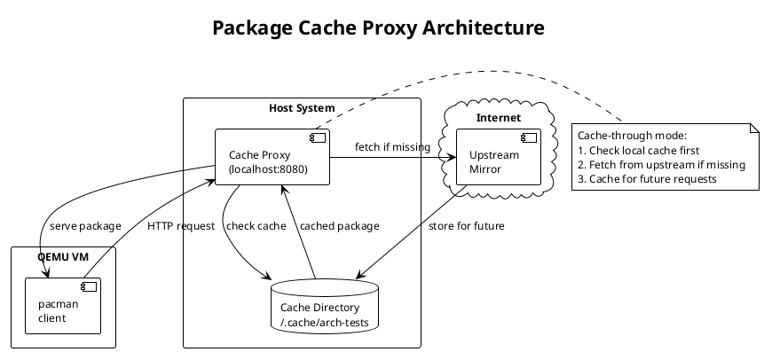

# Package Cache Proxy (Work In Progress)

The test suite includes a local package cache proxy that ensures reproducible installations by serving packages from a controlled cache rather than upstream mirrors.

## How It Works



1. The proxy starts an HTTP server on a random available port
2. VM's `/etc/pacman.d/mirrorlist` is configured to point to the proxy
3. When pacman requests a package:
   - **If cached**: Serve immediately from disk
   - **If not cached**: Fetch from upstream, cache, then serve
4. In **offline mode**: Only cached packages are served; missing packages fail the request

## Benefits

- **Reproducibility**: Same package versions across test runs
- **Speed**: Subsequent test runs use cached packages
- **Offline Testing**: Run tests without network access
- **CI-Friendly**: Pre-cache packages to avoid network dependencies in CI

## Usage

### Command Line Options

```bash
# Use default temporary cache (cleaned after tests)
poetry run pytest tests/qemu/

# Persist cache for faster subsequent runs
poetry run pytest tests/qemu/ --package-cache-dir ~/.cache/arch-installer-tests

# Run in offline mode (fail if any package not cached)
poetry run pytest tests/qemu/ --offline-mode --package-cache-dir ~/.cache/arch-installer-tests
```

### Pre-caching Packages

For CI environments or offline testing, pre-cache required packages:

```python
from pathlib import Path
from tests.qemu.package_cache import PackageCacheProxy, PackageCacheConfig, ESSENTIAL_PACKAGES

config = PackageCacheConfig(cache_dir=Path("./package-cache"))
proxy = PackageCacheProxy(config)
proxy.setup_cache_directory()

# Pre-cache essential packages
proxy.precache_packages(ESSENTIAL_PACKAGES)

# Check cache stats
print(proxy.cache_stats())
```

### Essential Packages

The following packages are pre-defined as essential for minimal installation tests:

- `base`, `linux`, `linux-firmware`
- `btrfs-progs`, `cryptsetup`
- `sbctl`, `systemd`, `mkinitcpio`
- `efibootmgr`, `networkmanager`
- `openssh`, `sudo`, `vim`

## Configuration

```python
from tests.qemu.package_cache import PackageCacheConfig

config = PackageCacheConfig(
    cache_dir=Path("~/.cache/arch-installer-tests"),
    host="0.0.0.0",      # Listen on all interfaces
    port=8080,           # HTTP port (auto-assigned if not available)
    upstream_mirrors=(   # Fallback mirrors for cache misses
        "https://geo.mirror.pkgbuild.com",
        "https://mirror.rackspace.com/archlinux",
    ),
    offline_mode=False,  # If True, fail on cache miss
    verify_signatures=True,  # Also cache .sig files
)
```

## Cache Directory Structure

```
cache_dir/
├── core/
│   └── os/
│       └── x86_64/
│           ├── base-3-1-x86_64.pkg.tar.zst
│           ├── base-3-1-x86_64.pkg.tar.zst.sig
│           └── ...
├── extra/
│   └── os/
│       └── x86_64/
│           └── ...
└── multilib/
    └── os/
        └── x86_64/
            └── ...
```

## CI Integration

### GitLab CI Example

```yaml
stages:
  - test

qemu-tests:
  stage: test
  image: archlinux:latest
  variables:
    CACHE_DIR: /cache/arch-installer-tests
  cache:
    key: pacman-cache
    paths:
      - /cache/arch-installer-tests/
  before_script:
    - pacman -Sy --noconfirm qemu-full edk2-ovmf python python-pip
    - pip install poetry
    - poetry install
  script:
    - curl -LO https://geo.mirror.pkgbuild.com/iso/latest/archlinux-x86_64.iso
    - |
      poetry run pytest tests/qemu/ \
        --arch-iso ./archlinux-x86_64.iso \
        --package-cache-dir $CACHE_DIR
  tags:
    - kvm # requires KVM-enabled runner
```

### Pre-populating Cache in CI

```yaml
pre-cache:
  stage: .pre
  script:
    - |
      python -c "
      from pathlib import Path
      from tests.qemu.package_cache import PackageCacheProxy, PackageCacheConfig, ESSENTIAL_PACKAGES

      config = PackageCacheConfig(cache_dir=Path('/cache/arch-installer-tests'))
      proxy = PackageCacheProxy(config)
      proxy.precache_packages(ESSENTIAL_PACKAGES)
      "
```

## Troubleshooting

### Cache Miss in Offline Mode

```
ERROR: package not in cache (offline mode): extra/os/x86_64/some-package.pkg.tar.zst
```

Solution: Run without `--offline-mode` first to populate the cache, or manually pre-cache the package.

### Port Already in Use

The proxy automatically finds a free port in the range 8080-9000. If all ports are busy, increase the range in `conftest.py`.

### Stale Cache

If you're seeing issues with outdated packages:

```bash
# Clear cache and re-run
rm -rf ~/.cache/arch-installer-tests
poetry run pytest tests/qemu/ --package-cache-dir ~/.cache/arch-installer-tests
```

## Python Package Caching (pip/poetry) (WIP)

For Python dependencies inside the VM, the test setup installs poetry which handles its own caching. The VM uses the host's network via QEMU's user-mode networking (10.0.2.2 gateway), so pip/poetry requests go through the host's network connection.

For fully offline Python package testing, you would need to:

1. Create a wheelhouse directory with pre-downloaded packages
2. Copy it to the VM
3. Use `pip install --no-index --find-links=/path/to/wheelhouse`

This is not currently implemented but could be added for stricter reproducibility.
